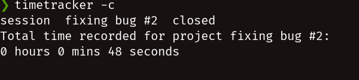

# TimeTracker

TimeTracker is a minimal shell utility written in bash that aims to be inobtrusive, yet useful.

## Usage

From the command line start tracking a new project with the command:

```bash
timetracker.sh -s <project>
```

say the project or task is named fixing bug #2:

```bash
timetracker.sh -s fixing bug #2
```

when you're done for the day close the project:

```bash
timetracker.sh -c
```

The output will contain the following information:



Use -h switch for help:

```TimeTracker is a time management utility to record the time spent on user-defined tasks/projects


Usage:
timetracker       [-s PROJECT | -p | -c | -i PROJECT | -h | --help ]

    -s PROJECT     Start session for PROJECT

    -p             Pause/resume session

    -c             Close background session for opened project

    -i PROJECT     Display info about the time spent in PROJECT

    -h, --help     Show this message
```

## Integration with i3wm and dmenu/rofi

This utility is meant to be integrated with a window manager for effortless time tracking. This eliminates the need to open a terminal to run the command.

In i3, set keybindings to handle timetracker functionality and see the output of the command on a notification:

```i3config
# send a list of your projects to dmenu and lets you pick or create a new one.
bindsym $mod+Shift+s exec notify-send "`timetracker -s $( ls ~/.TimeTracker | dmenu )`"

bindsym $mod+Shift+d exec notify-send "`timetracker -c`"

bindsym $mod+Shift+p exec notify-send "`timetracker -p`"
```

output of the first keybinding:

