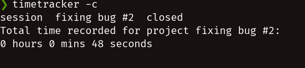
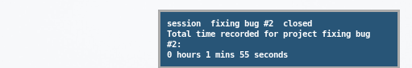

# TimeTracker

TimeTracker is a minimal shell utility written in bash that aims to be inobtrusive, yet useful.

## Usage

From the command line start tracking a new project with the command:

```bash
timetracker.sh -s <project>
```

say the project or task is named fixing bug #2:

```bash
timetracker.sh -s fixing bug #2
```

when you're done for the day close the project:

```bash
timetracker.sh -c
```

The output will contain the following information:



Use -h switch for help:

```TimeTracker is a time management utility to record the time spent on user-defined tasks/projects


Usage:
timetracker       [-s PROJECT | -p | -c | -i PROJECT | -h | --help ]

    -s PROJECT     Start session for PROJECT

    -p             Pause/resume session

    -c             Close background session for opened project

    -d             Delete last saved session

    -i PROJECT     Display info about the time spent in PROJECT

    -h, --help     Show this message
```

## Integration with i3wm and dmenu/rofi

This utility is meant to be integrated with a window manager for effortless time tracking. This eliminates the need to open a terminal to run the command.

In i3, set keybindings to handle timetracker functionality and see the output of the command on a notification.

On your i3 config file:

```i3config

# send a list of your projects to dmenu to pick or create a new one.
bindsym $mod+Shift+s exec notify-send "`timetracker.sh -s $( ls ~/.TimeTracker/projects | dmenu )`"

bindsym $mod+Shift+d exec notify-send "`timetracker.sh -c`"

bindsym $mod+Shift+p exec notify-send "`timetracker.sh -p`"
```

output of the second keybinding:



## Stopwatch Feature

TimeTracker has a built in stopwatch script that you can use to track your time.
The preferred way is to configure a program like i3status to read a file that is being constantly updated with stopwach progress.
i3status example:

```i3status config
general {
        interval = 1
}

order += "read_file stopwatch"

read_file stopwatch {
    format = "%title:  %content "
    format_bad = ""
    path = "~/.TimeTracker/stopwatch"
    color_good = "#f4f7f5"
}
```

Remember to set the interval directive to 1 if you want to see the stopwatch being updated every second.


